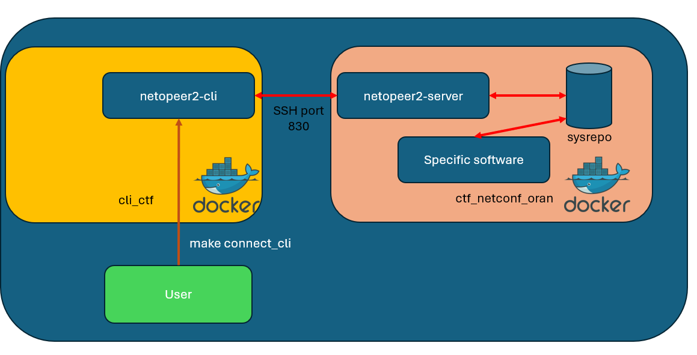
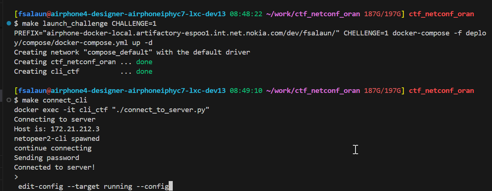
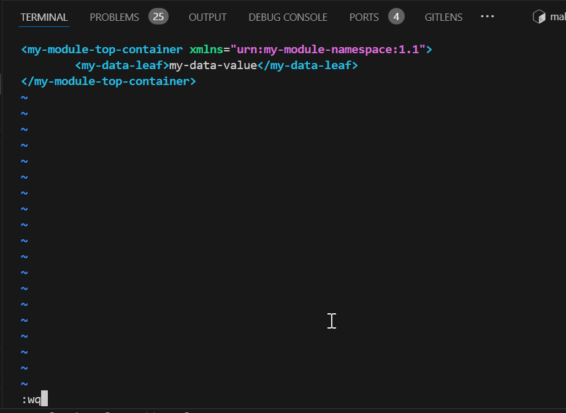
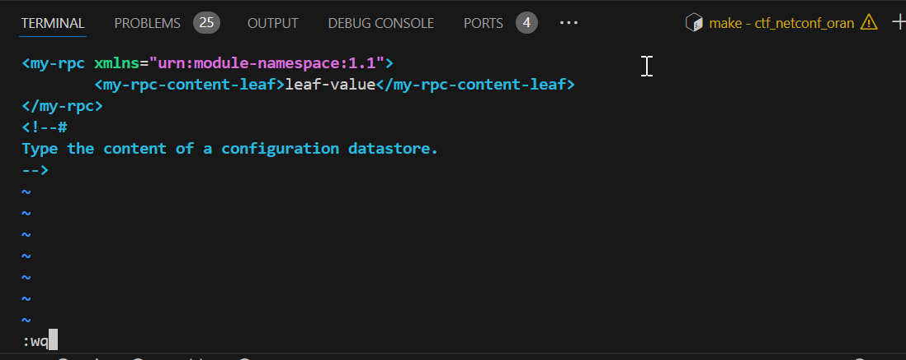

# Welcome to NETCONF CTF!

This is a small a friendly set of puzzles to get to know NETCONF Protocol.

Flags are all in the same format: `NOKCTF{The_flag_you_want}` , please submit the whole flag (not only the one in brackets)

## How to Participate in the NETCONF CTF
In order to be able to participate, you will need:
- Access to a Linux VM (or WSL)
- Basic Knowledge in NETCONF Protocol
- Basic Knowledge on understanding YANG Models

## How to get familiar with YANG and NETCONF?
Before starting the CTF, it is encouraged to read:

- [TechTarget Article on NETCONF](https://www.techtarget.com/searchnetworking/definition/NETCONF)
- [NETCONF Wikipedia](https://en.wikipedia.org/wiki/NETCONF)
- [Introduction To NETCONF/YANG](https://www.fir3net.com/Networking/Protocols/an-introduction-to-netconf-yang.html)

## What Infrastructure do I need?
Those challenges consist in connecting to a NETConf server via a 3rd party software called netopeer2-cli.
Upon launching the make command `make launch_challenge CHALLENGE=X`, you will spawn 2 docker containers:
- cli_ctf containing the netopeer2-cli toolset
- ctf_netconf_oran containing the challenge

You do not need anything more. Only commands below are supported, please do not use any other:
- `make launch_challenge CHALLENGE=X`
- `make connect_cli`
- `make enter_cli_container`

## How do I access to challenges?
You will need, installed on your VM:
- `make`
- `docker`
- `docker-compose`

You must clone the necessary files with the following command:
`git clone https://github.com/AeroFlorian/netconf-ctf-needed-files.git`

Then get in the repository:
`cd netconf-ctf-needed-files`

You can then launch any challenge with the command `make launch_challenge CHALLENGE=X` (X being your challenge number). It will create the docker containers for netopeer2-cli and the Netconf server. It will also launch the proper scenario on the Netconf server side.

Then you can directly enter the docker container containing the netopeer2-cli with the command
`make connect_cli`
It will automatically open netopeer2-cli and open a Netconf session with the NETConf server.
If you want to just enter the netopeer2-cli docker container to open files from /tmp , you can use :
`make enter_cli_container`
Please note that you do not need to enter the NetConf server container for any reason.

## Usage of netopeer2-cli

Documentation for netopeer2-cli: [Manual netopeer2-cli](https://manpages.ubuntu.com/manpages/kinetic/man1/netopeer2-cli.1.html)
For this CTF you will only need to use the following commands:
- `get`
- `edit-config` directly on `running`datastore, no need to go through `candidate`
- `user-rpc`
- `subscribe`
- `get-schema`

After launching your challenge with command `make launch_challenge CHALLENGE=X` and launching netopeer2-cli with command `make connect_cli`,
you can directly send commands.

### Sending RPC Get command

The `get`command will send an RPC Get to the Netconf Server. If you want to get every data possible, just send `get`. If you want to be more precise, use the option `--filter-xpath /the-module-you-want:*`. If you want to route data in a file, you can also use `--out` option, then `exit`and reconnect to cli container with `make enter_cli_container` to consult those files.

### Sending RPC Edit-Config
If you want to modify the current running configuration, use command `edit-config`. As it is just a CTF, no need to go through the standard `change candidate configuration and then commit`.
The easiest way is to use `edit-config --target running --config`. It will open vim, you can then paste the config you want to edit:

### Sending other RPCs
Same as Edit-config, you can user command `user-rpc`to send RPCs (that are not edit-config/get/get-schema/create-subscription).
Same as edit-config, easiest way is to use `user-rpc` and use vim to paste the rpc you want to send:

## ORAN CTF

### How to launch challenges

For O-RAN Challenges, a different docker image is used for the Netconf Server, as O-RAN official Yang Models are installed

To launch each of the challenges, use command `make launch_oran_challenge CHALLENGE=X`.

You can still use keyword `make connect_cli` to enter cli container and connect automatically to the Netconf Server.

As opposed to the NETCONF challenges, the flags will not be directly readable from the data.

Each challenge will ask you one type of data, you will then have to ask the Netconf Server for validation, using `validation` module (get the schema yourself!).

In case your answer is the right one, the Netconf Server will give you the flag.

### Links and Materials

In order to understand what is needed, you will need to have access to:

- Official WG4 MPlane Specification
- Official Yang Models provided by O-RAN WG4

The links are available in the home page of the Netconf + ORAN CTF.